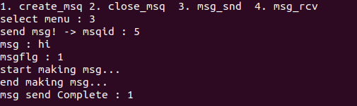

# IPC-and-MQTT-Protocol
Implement IPC(Message V Queue) and MQTT Protocol in Raspberry Pi 3

## How To Run
 - [ReadMe](https://github.com/wh2per/Raspberry-Pi-3/blob/master/README.md)
 
## Example
### 1. IPC(Message V Queue)
+ ### Operation Keys
  * `1` Botton : Create Message Queue
  * `2` botton : Close Message Queue
  * `3` Botton : Send Message
  * `4` botton : Receive Message
  * `5` Botton : Exit
+ ### ScreenShot
  #### 1. Create Message Queue
  + Input right value
     
  + Input duplicate value
     
  #### 2. Close Message Queue
   + <b>Input right value
      
   + <b> Input missing value
      
  #### 3. Send Message
   + <b> Input right value
      
   + <b> When the message queue is full (wait)
       
   + <b> When there are extra places in the message queue after full
       
   + <b> When the message queue is full (not wait)
       
  #### 4. Receive Message
   + <b> Input right value
      
   + <b> When the message queue is empty (wait)
       
   + <b> When there is a message in the message queue after empty
       
   + <b> When the message queue is empty (not wait)
       
  #### 5. Exit
   + <b> Input `5`
       
 
### 2. MQTT

